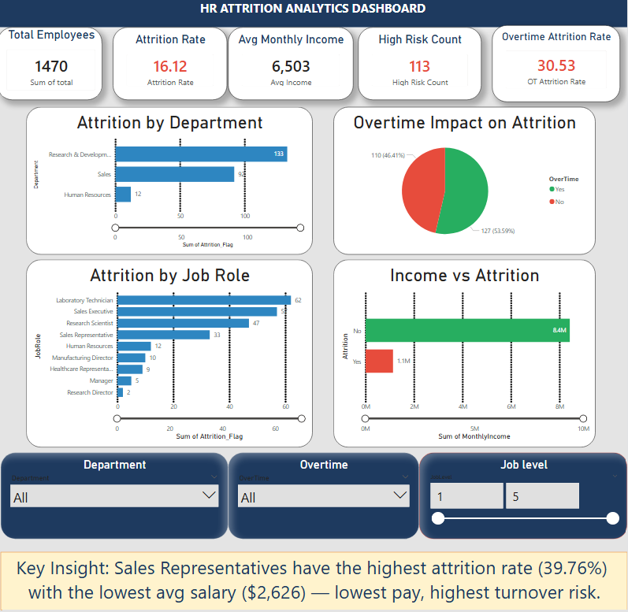
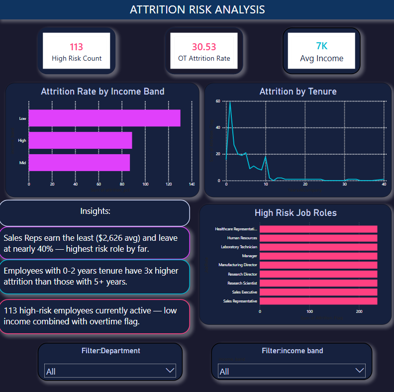

# HR Analytics Pipeline

## Overview
End-to-end HR analytics pipeline analyzing IBM HR Attrition dataset (1,470 employees) to identify key drivers of employee turnover.

## Stack
Python · Pandas · NumPy · Scikit-learn · SQLAlchemy · SQLite · Matplotlib · Seaborn · Openpyxl · Power BI

## Key Findings
- Overall attrition rate: **16.12%**
- Overtime attrition rate: **30.53%**
- Sales Representatives have highest attrition **(39.76%)** with lowest avg salary ($2,626)
- **113 high-risk employees** identified (low income + left)
- Top attrition driver: **OverTime**

## Project Structure
- `HR_Analytics.ipynb` — full pipeline notebook (7 weeks)
- `data/` — raw, processed CSVs and SQLite database
- `charts/` — all generated visualizations
- `Overview_dashboard.png` — Power BI Page 1
- `Risk_analysis_dashboard.png` — Power BI Page 2

## Dashboard

